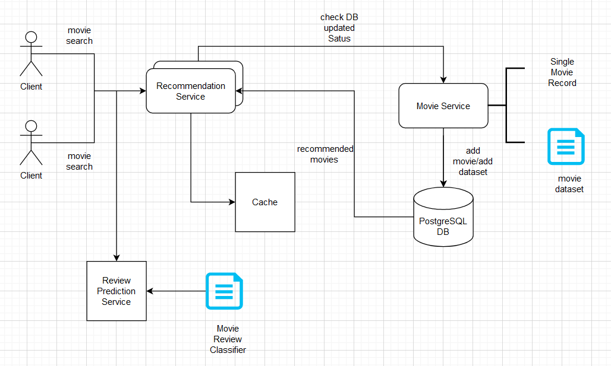

# content-based-movie-recommendation-system
## Summary
Content Based Movie Recommendation System Using Python, Flask, PostgreSQL

### Technologies
1. Python
2. Flask
3. PostgreSQL
4. Scikit-learn

### Concepts
1. REST API
2. Cosine Similarity
3. Data Preprocessing
4. Data Store

### Architecture


### API Specifications

Endpoint

```text
POST /store
```

Example of body

```json
{
    "movie_file_path" :<localhost-path-to-movie-dataset>,
    "db_name": <db_name>,
    "username": <username>,
    "password": <password>
}
```
Endpoint

```text
POST /get_recommendations
```

Example of body

```json
{
    "movie_name":<movie-name>,
    "username": <username>,
    "password": <password>
}
```
Example Output of above Endpoint

```json
{
    "recommended_movies": [
        "Avatar",
        "The Chronicles of Riddick",
        "Star Trek Into Darkness",
        "Star Trek Beyond",
        "The Avengers",
        "Stargate: The Ark of Truth",
        "Avengers: Age of Ultron",
        "Planet of the Apes",
        "Zathura: A Space Adventure",
        "X-Men: Days of Future Past"
    ]
}
```